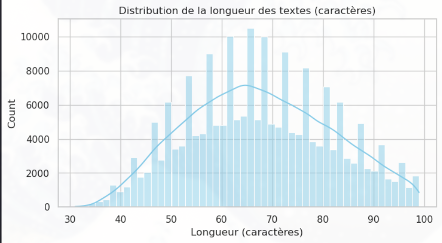
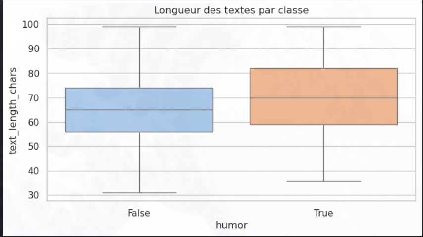

# Détection et Génération de Contenu Humoristique

## Exploration des jeu de données

## Jeu de données : `data/processed/colbert_humor.csv`

Description générale
- Fichier principal utilisé : `data/processed/colbert_humor.csv` (version nettoyée produite par `traitement.py`).
- Colonnes présentes et rôle attendu :
	- `text` : texte brut (titre, phrase ou blague) issu du jeu de données original.
	- `humor` : étiquette initiale (booléen ou indicateur) signalant si l'instance était annotée comme humoristique.
	- `label` : version normalisée de `humor` codée en 0/1 (0 = non-humour, 1 = humour) produite par le script de traitement.
	- `text_clean` : texte prétraité (lowercase, suppression d'URLs/HTML, normalisation de la ponctuation et réduction des espaces) prêt pour vectorisation ou tokenisation.

Nettoyage et prétraitement (résumé de `traitement.py`)
- Le script `traitement.py` effectue un prétraitement simple et robuste :
	- conversion en minuscules, suppression d'URLs et de balises HTML ;
	- normalisation des caractères non-textuels (conserve les apostrophes et quelques ponctuations utiles) ;
	- collapse des espaces multiples ;
	- création d'une colonne `label` entière dérivée de `humor` afin d'assurer une compatibilité directe avec des pipelines d'apprentissage supervisé ;
	- suppression des lignes où le texte devient vide après nettoyage.

Statistiques descriptives et visualisations (résumé)

Des visualisations ont été générées et sont incluses dans le dossier `images/`. Elles illustrent les points clés du jeu de données ci-dessous.

Répartition des classes

La figure ci‑dessus présente la distribution des classes (humour vs non‑humour) sous forme de barplot. On y voit que le jeux de donnée est parfaitement équilibré avec autant de humour et non-humour.

Distribution des longueurs de textes

Cette distribution (histogramme / densité) montre que la majorité des instances sont courtes (titres, one‑liners). Elle sert à fixer une valeur raisonnable de `max_length` pour la tokenisation.

Longueur des textes par classe

Le boxplot compare la longueur des textes entre classes. Si une classe contient systématiquement des textes plus longs ou plus courts, cela peut introduire un biais exploitable par le modèle (signal non désiré). Cette visualisation sert aussi à détecter valeurs aberrantes qui méritent un nettoyage supplémentaire.

## Entrainement

Cette section décrit la procédure d'entraînement utilisée dans le notebook `test.ipynb`. Le notebook implémente un fine-tuning simple d'un modèle de type Transformer (ex. DistilBERT) pour la classification binaire (humour vs non-humour). Ci‑dessous on retrouve les étapes principales, les choix d'hyperparamètres, les artefacts produits et les instructions pour reproduire l'entraînement.

### 1) Données et préparation
- Fichier principal : `data/processed/colbert_humor.csv` (produit par `traitement.py`). Colonnes attendues :
	- `text` : texte brut à classer.
	- `humor` / `label` : étiquette d'origine et/ou version normalisée 0/1.
- Chargement dans un objet `datasets.Dataset` puis split train/test (test_size=0.2, seed=42).
- Tokenisation : `AutoTokenizer` (ex. `distilbert-base-uncased`) sur la colonne `text`.
	- Troncature et padding (`truncation=True`, `padding='max_length'`) avec `max_length=128` (valeur choisi d'après la distribution des longueurs).
- S'assurer que la colonne d'étiquette s'appelle `labels` et possède des entiers (0/1) pour la compatibilité avec `Trainer`.

### 2) Modèle et configuration d'entraînement
- Backbones testés : un modèle de la famille BERT (ex. `distilbert-base-uncased`) chargé via `AutoModelForSequenceClassification` avec `num_labels=2`.
- Entraînement via `transformers.Trainer` avec les arguments suivants (extrait du notebook) :
	- `output_dir`: `./results`
	- `learning_rate`: 2e-5
	- `per_device_train_batch_size`: 16
	- `per_device_eval_batch_size`: 16
	- `num_train_epochs`: 3
	- `weight_decay`: 0.01
	- `save_total_limit`: 1
	- `fp16`: True (si la machine/driver le supporte)

### 3) Métriques
- La métrique calculée dans le notebook est l'accuracy. La fonction `compute_metrics` :
	- transforme logits en prédictions (argmax pour multi‑classe, seuil 0.5 pour binaire si nécessaire) et retourne `{'accuracy': float(acc)}`.
- Recommandation : ajouter F1-score (macro/weighted) et matrice de confusion pour une meilleure évaluation sur un jeu déséquilibré.

### 4) Remarque
- Après l'entraînement, j'ai testé le modèle (entraîné sur des données en anglais) sur des phrases et blagues en français : il a correctement distingué humour / non-humour. En conséquence, j'ai décidé d'entraîner et d'évaluer un modèle quasi identique mais multilingue afin de comparer les performances entre la version monolingue et la version multilingue.
