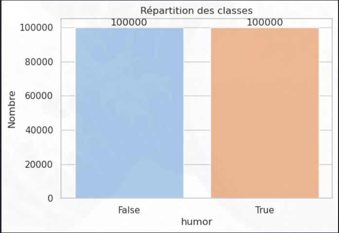
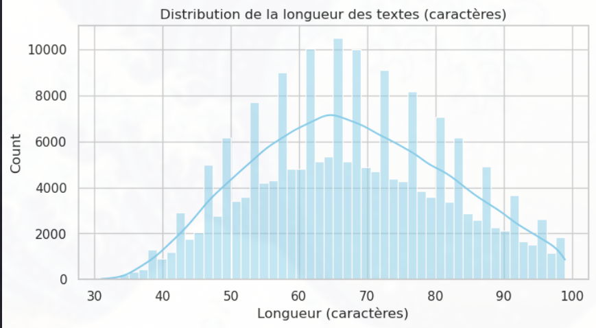
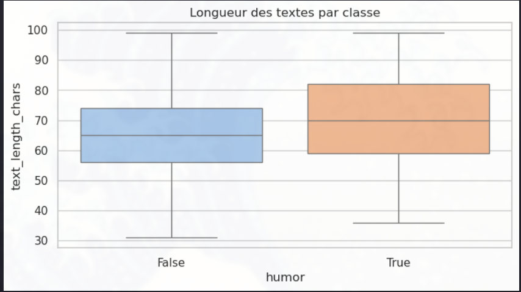

# Détection et Génération de Contenu Humoristique

## Exploration des jeu de données

## Jeu de données : `data/processed/colbert_humor.csv`

Description générale
- Fichier principal utilisé : `data/processed/colbert_humor.csv` (version nettoyée produite par `traitement.py`).
- Colonnes présentes et rôle attendu :
	- `text` : texte brut (titre, phrase ou blague) issu du jeu de données original.
	- `humor` : étiquette initiale (booléen ou indicateur) signalant si l'instance était annotée comme humoristique.
	- `label` : version normalisée de `humor` codée en 0/1 (0 = non-humour, 1 = humour) produite par le script de traitement.
	- `text_clean` : texte prétraité (lowercase, suppression d'URLs/HTML, normalisation de la ponctuation et réduction des espaces) prêt pour vectorisation ou tokenisation.

Nettoyage et prétraitement (résumé de `traitement.py`)
- Le script `traitement.py` effectue un prétraitement simple et robuste :
	- conversion en minuscules, suppression d'URLs et de balises HTML ;
	- normalisation des caractères non-textuels (conserve les apostrophes et quelques ponctuations utiles) ;
	- collapse des espaces multiples ;
	- création d'une colonne `label` entière dérivée de `humor` afin d'assurer une compatibilité directe avec des pipelines d'apprentissage supervisé ;
	- suppression des lignes où le texte devient vide après nettoyage.

Statistiques descriptives et visualisations (résumé)

Des visualisations ont été générées et sont incluses dans le dossier `images/`. Elles illustrent les points clés du jeu de données ci-dessous.

Répartition des classes

La figure ci‑dessus présente la distribution des classes (humour vs non‑humour) sous forme de barplot. On y voit que le jeux de donnée est parfaitement équilibré avec autant de humour et non-humour.

Distribution des longueurs de textes

Cette distribution (histogramme / densité) montre que la majorité des instances sont courtes (titres, one‑liners). Elle sert à fixer une valeur raisonnable de `max_length` pour la tokenisation.

Longueur des textes par classe

Le boxplot compare la longueur des textes entre classes. Si une classe contient systématiquement des textes plus longs ou plus courts, cela peut introduire un biais exploitable par le modèle (signal non désiré). Cette visualisation sert aussi à détecter valeurs aberrantes qui méritent un nettoyage supplémentaire.

## Entrainement

Cette section décrit la procédure d'entraînement utilisée dans le notebook `test.ipynb`. Le notebook implémente un fine-tuning simple d'un modèle de type Transformer (ex. DistilBERT) pour la classification binaire (humour vs non-humour). Ci‑dessous on retrouve les étapes principales, les choix d'hyperparamètres, les artefacts produits et les instructions pour reproduire l'entraînement.

### 1) Données et préparation
- Fichier principal : `data/processed/colbert_humor.csv` (produit par `traitement.py`). Colonnes attendues :
	- `text` : texte brut à classer.
	- `humor` / `label` : étiquette d'origine et/ou version normalisée 0/1.
- Chargement dans un objet `datasets.Dataset` puis split train/test (test_size=0.2, seed=42).
- Tokenisation : `AutoTokenizer` (ex. `distilbert-base-uncased`) sur la colonne `text`.
	- Troncature et padding (`truncation=True`, `padding='max_length'`) avec `max_length=128` (valeur choisi d'après la distribution des longueurs).
- S'assurer que la colonne d'étiquette s'appelle `labels` et possède des entiers (0/1) pour la compatibilité avec `Trainer`.

### 2) Modèle et configuration d'entraînement
- Backbones testés : un modèle de la famille BERT (ex. `distilbert-base-uncased`) chargé via `AutoModelForSequenceClassification` avec `num_labels=2`.
- Entraînement via `transformers.Trainer` avec les arguments suivants (extrait du notebook) :
	- `output_dir`: `./results`
	- `learning_rate`: 2e-5
	- `per_device_train_batch_size`: 16
	- `per_device_eval_batch_size`: 16
	- `num_train_epochs`: 3
	- `weight_decay`: 0.01
	- `save_total_limit`: 1
	- `fp16`: True (si la machine/driver le supporte)

### 3) Métriques
- La métrique calculée dans le notebook est l'accuracy. La fonction `compute_metrics` :
	- transforme logits en prédictions (argmax pour multi‑classe, seuil 0.5 pour binaire si nécessaire) et retourne `{'accuracy': float(acc)}`.
- Recommandation : ajouter F1-score (macro/weighted) et matrice de confusion pour une meilleure évaluation sur un jeu déséquilibré.

### 4) Remarque
- Après l'entraînement, j'ai testé le modèle (entraîné sur des données en anglais) sur des phrases et blagues en français : il a correctement distingué humour / non-humour. En conséquence, j'ai décidé d'entraîner et d'évaluer un modèle quasi identique mais multilingue afin de comparer les performances entre la version monolingue et la version multilingue.

## Comparaison des models

j'ai testé les deux modèles sur quelque texte que j'ai écris, pour voir si ils me sortait la même réponse, j'aurai du poussé en utilisant l'autre jeu de donné que j'avais récupéré ou il n'y a aucun label humor pour essayer de le classifier avec les deux modèle et voir une comparaison

--- Running pipeline for humor_detection_model01 ---
Text: j'ai faim
J'ai comparé qualitativement deux modèles locaux en exécutant des prédictions sur un petit jeu d'exemples (les tests et la sortie complète sont disponibles dans le notebook `comparaison_des_models.ipynb`). Voici un résumé clair et concis des observations, de leur interprétation et des recommandations.

Observations principales
- `humor_detection_model01` : sur des phrases françaises et anglaises courtes, les prédictions sont globalement cohérentes (Humor / Not Humor). En revanche, les phrases en coréen ont majoritairement été classées comme non‑humoristiques.
- `humor_model_multilingual` : performances similaires au modèle 1 pour le français/l'anglais, mais meilleure détection de l'humour sur les exemples en coréen et d'autres langues (plus de prédictions "Humor").

Interprétation
- Le comportement observé concorde avec l'origine des modèles : le modèle multilingue ayant été entraîné sur un corpus couvrant de nombreuses langues est plus apte à reconnaître l'humour hors anglais. Le modèle basé sur DistilBERT (en pratique entraîné principalement sur de l'anglais) montre des limites sur des langues qu'il n'a pas rencontrées pendant l'entraînement.

Limitations de cette comparaison
- L'évaluation présentée est qualitative et basée sur quelques exemples manuels. Elle ne permet pas de conclure sur les performances réelles en production.
- Les paramètres de tokenisation/prétraitement et les seuils de décision peuvent influencer fortement les résultats — il faut s'assurer que les deux pipelines sont configurés de façon comparable (mêmes `max_length`, padding, etc.).

Recommandations et prochaines étapes
1. Réaliser une évaluation quantitative sur un jeu étiqueté multilingue (ex. un sous‑ensemble labellisé de `data/processed/colbert_humor.csv` si des labels multilingues sont disponibles) en calculant accuracy, F1 (macro/weighted) et matrice de confusion.
2. Standardiser le prétraitement et la tokenisation pour chaque modèle avant comparaison (mêmes paramètres de padding/truncation).
3. Documenter et inclure les sorties complètes du notebook dans le rapport (captures ou tableau récapitulatif) afin de garder une trace reproductible des tests.

Extrait synthétique de la sortie observée (voir le notebook pour la sortie complète) :
- `humor_detection_model01` a classé les phrases coréennes principalement en `Not Humor`.
- `humor_model_multilingual` a classé ces mêmes phrases majoritairement en `Humor`.

En résumé : les tests exploratoires montrent un avantage du modèle multilingue sur des exemples non‑anglophones, mais une évaluation quantitative sur un jeu de test approprié est nécessaire pour tirer des conclusions robustes.

## Génération
- Choix du modèle : j'ai testé un grand modèle causal pour la génération. Un modèle non affiné produisait des sorties qui n'avaient pas le format d'une blague (ou n'avaient pas de sens). Pour améliorer la qualité, j'ai prévu un fine‑tuning sur notre jeu de blagues courtes.
- Processus : le notebook contient (1) l'installation des dépendances, (2) un exemple de fine‑tuning (préparation des données, tokenisation, création d'un Trainer), (3) une fonction de génération `generate_jokes(prompt, ...)` qui produit plusieurs candidats, et (4) un filtrage/score des candidats à l'aide de classifieurs locaux.
- Filtrage : les candidats générés sont évalués par des classifieurs binaires (ex. `humor_detection_model01` et `humor_model_multilingual`). Le notebook inclut des mécanismes pour charger ces classifieurs même si seuls les poids/config existent (fallback tokenizers) et pour corriger des `input_ids` hors‑vocabulaire avant scoring.

Etat actuel et limites
- J'ai préparé et lancé le fine‑tuning sur le jeu de blagues courtes, mais je n'ai pas encore validé systématiquement les sorties post‑entraînement dans ce rapport. L'étape suivante consiste à générer un lot de candidats avec le modèle affiné puis à appliquer nos classifieurs pour garder les meilleurs exemples.

